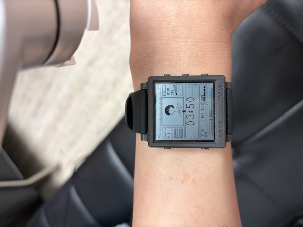
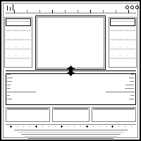

# MoWatch Sci-Fi Avatar Watch Face

A sci-fi HUD style watch face for MoWatch e-ink smartwatch, featuring a customizable avatar display.

<p align="center">
  
</p>

## Features

- **Sci-Fi HUD Design**: Futuristic interface with panels, borders and indicators
- **Avatar Display**: 120x120px avatar with intelligent edge detection for clean e-ink rendering
- **LED-Style Time**: Large 20x32px digital clock in the center
- **Status Indicators**:
  - RAD (Radiation) meter with bar graph
  - SYS (System) status display
  - Signal strength indicator
  - Battery percentage with level bars
  - Date and day of week
  - Coordinates display
  - Seconds progress bar

## Screenshots

| Avatar Preview | Background |
|:---:|:---:|
|  |  |

## Project Structure

```
app_avatar/
├── code/
│   ├── app_main.c          # Main watch face code
│   ├── avatar_graphics.h   # Avatar and digit bitmaps
│   ├── background.h        # HUD background bitmap
│   ├── process_avatar.py   # Avatar image processor
│   ├── generate_background.py
│   └── generate_digits.py
└── gcc/
    ├── Makefile
    ├── app.ld
    └── createmwa.py        # .mwa package creator
```

## Building

### Prerequisites

- Docker
- Python 3 with Pillow (`pip install Pillow`)

### Build Steps

1. Build the Docker image (first time only):
   ```bash
   cd /path/to/小程序开发环境
   docker build -t mowatch-sdk .
   ```

2. Compile the watch face:
   ```bash
   cd app_avatar/gcc
   docker run --rm -v "$(pwd)/../..:/build" mowatch-sdk make -C /build/app_avatar/gcc
   ```

3. Create the .mwa package:
   ```bash
   python3 createmwa.py
   ```

## Customizing Avatar

1. Prepare your avatar image (recommended: square aspect ratio, clear background)

2. Process the avatar:
   ```bash
   cd code
   python3 process_avatar.py /path/to/your/avatar.jpg
   ```

3. The script will generate `avatar_new.h` with optimized edge detection for e-ink display

4. Copy the data to `avatar_graphics.h` and rebuild

## Installation

1. Connect MoWatch to computer via USB (enable USB mode on watch)
2. Copy `Avatar.mwa` to the `apps` folder on the watch
3. Safely eject the watch
4. Select the watch face from the watch menu

## Technical Details

- **Display**: 200x200 pixel monochrome e-ink
- **MCU**: ARM Cortex-M3
- **Avatar Size**: 120x120px source, scaled to 65x65px on display
- **Digit Size**: 20x32px per digit
- **Update Interval**: Every minute (partial refresh)

## License

MIT License
